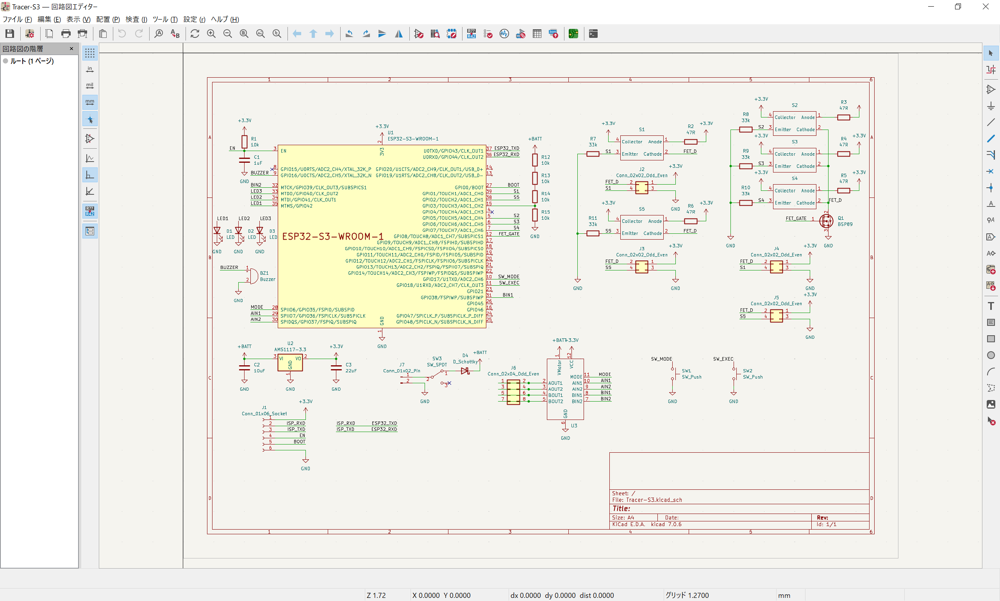
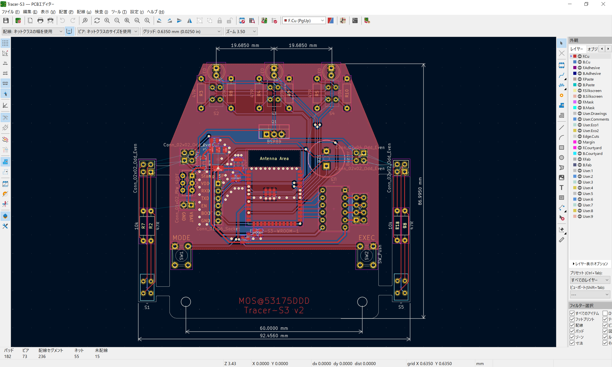

# 基板概要

JLCPCB の PCBA に対応した，私 [MOS](https://x.com/53175ddd) 作成のオリジナルライントレーサです  
表面実装部品（ESP32-S3 モジュール・SMD 抵抗・コンデンサ・レギュレータ・ダイオード）のみ PCBA で実装してくれるようにしています  
それ以外の部品については下記部品表を参考に，必要に応じて部品を変更するなどしてご利用ください

# イメージ

  

  

# 部品表

| 部品番号 | 定数 | 秋月 |
|----|----|----|
| R2 ~ R6 | 47Ω 1/4W | <https://akizukidenshi.com/catalog/g/g125470/> |
| R7 ~ R11 | 3.3kΩ ~ 4.7kΩ 1/4W | 省略 |
| SW1, SW2 | タクトスイッチ | <https://akizukidenshi.com/catalog/g/g103648/> |
| SW3 | DPDT スイッチ | <https://akizukidenshi.com/catalog/g/g102627/> |
| Q1 | MOSFET | <https://akizukidenshi.com/catalog/g/g107597/> |
| U3 | モータドライバ DRV8835 | <https://akizukidenshi.com/catalog/g/g109848/> |
| BZ1 | ブザー | <https://akizukidenshi.com/catalog/g/g104118/> |
| J1 | 1x6 ピンソケット | <https://akizukidenshi.com/catalog/g/g103784/> |
| J2, J3 | 2x2 ピンヘッダ | <https://akizukidenshi.com/catalog/g/g116792/> |
| J6 | 2x4 ピンヘッダ | <https://akizukidenshi.com/catalog/g/g116793/> |
| J7 | バッテリコネクタ | 使用するバッテリに合うものを使用してください |
| D1 ~ D3 | 5V 抵抗内蔵 LED | <https://akizukidenshi.com/catalog/g/g106247/> |
| S1 ~ S5 | フォトセンサ LBR-127HLD | <https://akizukidenshi.com/catalog/g/g104500/> |

# その他部品

- タミヤ ギアボックス
- Li-Po バッテリ（2S）など
- Stamp ISP

がそれぞれ必要になります
